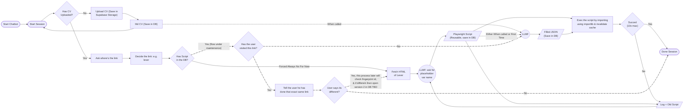

```mermaid
flowchart LR
    %% Nodes definition
    StartChatbot(["Start Chatbot"])
    StartSession(["Start Session"])
    HasCV{"Has CV<br/>Uploaded?"}
    AskLink["Ask where's the link"]
    DecideLink["Decide the link: e.g.<br/>lever"]
    UploadCV["Upload CV (Save in<br/>Supabase Storage)"]
    MdCV["Md CV (Save in DB)"]

    HasScript{"Has Script<br/>in the DB?"}
    FetchHTML["Fetch HTML<br/>of Lever"]

    VisitedLink{"Has the user<br/>visited this link?"}
    TellUser["Tell the user he has<br/>done that exact same link"]
    UserSaysDiff{"User says its<br/>different?"}

    LLMFAsk(("LLMF: ask for<br/>placeholder<br/>var name"))
    PlaywrightScript[/"Playwright Script<br/>(Reusable, save in DB)"/]
    ExecScript["Exec the script by importing<br/>using importlib & invalidate cache"]
    Succed{"Succed<br/>(10x max)"}
    DoneSession(["Done Session"])
    LogOld[/"Log + Old Script"/]

    LLMF(("LLMF"))
    FilledJSON[/"Filled JSON<br/>(Save in DB)"/]

    %% Solid Connections (Indices 0 - 20)
    StartChatbot --> StartSession
    StartSession --> HasCV
    HasCV -- "Yes" --> AskLink
    HasCV -- "No" --> UploadCV
    UploadCV --> MdCV
    MdCV --> StartSession
    AskLink --> DecideLink
    DecideLink --> HasScript
    HasScript -- "Forced Always No For Now" --> FetchHTML
    FetchHTML --> LLMFAsk
    LLMFAsk --> PlaywrightScript
    PlaywrightScript --> ExecScript
    ExecScript --> Succed
    Succed -- "Yes" --> DoneSession
    Succed -- "No" --> LogOld
    PlaywrightScript --> LogOld
    LogOld --> LLMFAsk
    UserSaysDiff -. "No" .-> DoneSession
    VisitedLink -. "Yes" .-> TellUser
    LLMF --> FilledJSON
    FilledJSON --> ExecScript

    %% Dotted Connections (...) (Index 21)
    MdCV -. "When called" .-> LLMF
    PlaywrightScript -. "Either When called or First Time" .-> LLMF

    %% Dash-Dot Connections (._._) (Indices 23 - 26)
    HasScript -. "Yes (flow under maintenance)" .-> VisitedLink
    VisitedLink -. "No" .-> LLMF
    TellUser -.-> UserSaysDiff
    UserSaysDiff -. "Yes, this process later will check fingerprint id,<br/>& if different then open version 2 in DB TBD" .-> FetchHTML

    %% Custom Stroke Styles for Mermaid.live renderer:
    %% Index 21: Dotted line (...)
    linkStyle 21,22 stroke-dasharray: 2 3,stroke-width: 2px;
    %% Indices 17,18,23-26: Dash-dot lines (._._)
    linkStyle 17,18,23,24,25,26 stroke-dasharray: 10 3 2 3,stroke-width: 2px;
```